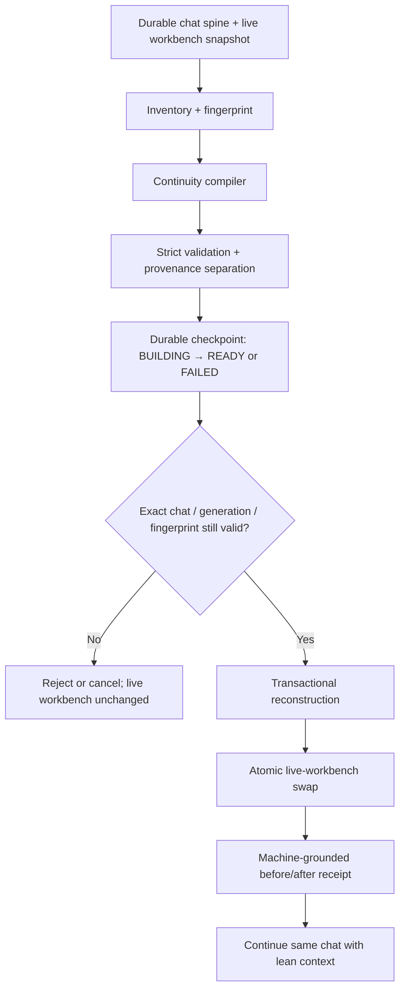

# Reforge — Transactional Context Reconstruction

*Technical Architecture & Empirical Validation Reference · v1.0 · 2026-09-26*
*Classification: PUBLIC_PRODUCT_DOC · Maintainer: Bino5150 / BINO the Great*
*Repository: <https://github.com/Bino5150/lumina>*
*Source-vetted against public `main` @ `fa1202b136c0ef2446bd208a41517057b0cea2e5`*
*Primary owner-facing release commit: `3c72e016490a8672478f18ae27dc8f08465d3905`*
*Shipped surface: Desktop-owner-only `/context rebuild`*
*Historical engineering codename: Ox Alpha*

## Transactional Context Reconstruction for Long-Lived Agent Sessions

> **Clean the workbench. Keep the blueprint.**

Reforge is Lumina's context-reconstruction architecture for long-lived agent sessions. It is designed around a simple observation that became an engineering invariant:

> **The durable conversation and the active execution workbench are not the same lifecycle object.**

A long-running agent can accumulate large amounts of useful *and* disposable state: tool calls, tool results, temporary reasoning context, provider-specific request artifacts, recent task scaffolding, and other execution debris. Persisting the entire conversation is valuable. Re-sending the entire execution workbench forever is not.

Reforge separates those concerns.

Instead of merely shortening an old prompt, Reforge builds a new, bounded working context from Lumina's durable conversational spine plus a provenance-aware continuity checkpoint, validates that checkpoint against the exact chat state it was built from, and transactionally swaps the hot in-memory workbench only if the reconstruction is still safe to consume.

The durable transcript remains intact. Forensic execution history remains available through the Flight Recorder. The active prompt is rebuilt to contain what is useful for reasoning forward rather than everything that happened while getting there.

---

## 1. Status and shipped boundary

As of the source-vetted public Lumina release at:

`fa1202b136c0ef2446bd208a41517057b0cea2e5`

Reforge is shipped as an **owner-triggered, same-chat reconstruction command**:

```text
/context
/context status
/context rebuild
```

The owner-facing command family was publicly released in:

**Commit:** `3c72e016490a8672478f18ae27dc8f08465d3905`
**Subject:** `feat: add owner context rebuild controls`
**Commit timestamp:** **2026-09-03 21:51:03 -05:00**
**GitHub-normalized timestamp:** `2026-09-04T02:51:03Z`
**Public commit:** <https://github.com/Bino5150/lumina/commit/3c72e016490a8672478f18ae27dc8f08465d3905>
**Repository:** <https://github.com/Bino5150/lumina>

The shipped command is deliberately **desktop-owner-only**. It is not exposed as a model-callable tool and is not reachable through Telegram or another external channel merely because content asks for a rebuild.

Automatic/unattended Reforge is **not** claimed as shipped in this document. Earlier adversarial review explicitly kept automatic A7-style reconstruction uncleared pending stronger benefit estimation, continuation-fidelity, race, cancellation, and operational-economics evidence.

---

## 2. The problem Reforge solves

Long-lived agent sessions contain multiple kinds of state with different durability requirements.

Lumina's context-lifecycle research converged on three conceptual layers:

```text
Durable Conversation Spine
        ↓
Structured Task / Continuity Checkpoint
        ↓
Ephemeral Execution Working Set
```

The durable spine includes the persisted conversational record that should survive chat switching, application restart, and reconstruction.

The execution working set contains the much noisier state required to perform the *current* work: tool calls, tool results, transient task scaffolding, provider-specific request structures, and other material that may have been useful once but should not necessarily remain in every future prompt.

A structured continuity checkpoint bridges the two. It preserves bounded continuation state without requiring the entire execution tape to remain hot.

This distinction was not invented as an abstract optimization. It emerged from measured runtime behavior.

### 2.1 Foundational observation

A long coding conversation reached approximately **167k active tokens**. After restart/re-entry, the same persisted conversation returned at approximately **64k active tokens** while remaining coherent and useful.

That suggested that persisted conversation and active execution state were already behaving like different lifecycle objects.

### 2.2 Controlled reconstruction experiment

A later controlled 42-minute engineering workload grew a fresh chat from roughly **34.3k** to **115,116 active tokens**.

After a clean exit and re-entry of the same persisted conversation:

```text
~115.1k → ~46k
≈60% reduction
```

A same-runtime experiment then isolated the important boundary:

```text
83,710
→ switch away / re-enter same chat
~59.5k
→ full process restart
~59.3k
```

The second step changed almost nothing.

The useful boundary was therefore **conversation unload/re-entry and prompt reconstruction**, not process restart itself.

Source inspection established the corresponding runtime split:

```text
ContextManager.history = live in-process workbench
SQLite chat_messages    = durable conversational spine
```

Reforge turned that observed behavior into an explicit, testable, owner-controlled architecture.

---

## 3. What Reforge does

At a high level, Reforge performs five jobs:

1. **Freeze and fingerprint the relevant durable state.**
2. **Compile a bounded continuity artifact from durable and ephemeral evidence.**
3. **Validate and store that artifact as an exact checkpoint.**
4. **Revalidate the active chat and checkpoint immediately before use.**
5. **Atomically replace the hot workbench with a reconstructed one.**

It does **not** rewrite the durable chat transcript.

It does **not** require the model to "remember everything."

It does **not** elevate summaries, tool output, web content, or remembered text into owner authority.

It does **not** use model narration as proof that reconstruction succeeded.

The intended contract is:

> **Keep what matters, discard what does not, and remain truthful about the difference.**

---

## 4. Architecture

The current architecture is implemented primarily across:

- `core/context_inventory.py`
- `core/context_reconstruction.py`
- `core/context_checkpoints.py`
- `core/continuity_compiler.py`
- `core/context_transaction.py`
- `core/context_rebuild.py`
- `core/operator_commands.py`
- `core/context.py`
- `core/flight_recorder.py`

Source-vetted public references at `fa1202b136c0ef2446bd208a41517057b0cea2e5`:

- <https://github.com/Bino5150/lumina/blob/fa1202b136c0ef2446bd208a41517057b0cea2e5/core/context_rebuild.py>
- <https://github.com/Bino5150/lumina/blob/fa1202b136c0ef2446bd208a41517057b0cea2e5/core/continuity_compiler.py>
- <https://github.com/Bino5150/lumina/blob/fa1202b136c0ef2446bd208a41517057b0cea2e5/core/context_checkpoints.py>
- <https://github.com/Bino5150/lumina/blob/fa1202b136c0ef2446bd208a41517057b0cea2e5/core/context_transaction.py>
- <https://github.com/Bino5150/lumina/blob/fa1202b136c0ef2446bd208a41517057b0cea2e5/core/context_reconstruction.py>
- <https://github.com/Bino5150/lumina/blob/fa1202b136c0ef2446bd208a41517057b0cea2e5/core/context_inventory.py>

### 4.1 Reconstruction pipeline



### 4.2 Durable-state fingerprinting

A checkpoint is not treated as a free-floating summary.

The checkpoint is bound to the chat and to the durable state from which it was compiled. A stale durable spine is rejected rather than silently reused.

This matters because a continuity artifact that was valid one moment ago can become wrong after:

- the conversation changes;
- a different chat becomes active;
- the active context generation changes;
- the durable spine changes;
- an emergency stop invalidates the operation;
- cancellation occurs;
- a different checkpoint supersedes the intended operation.

Reforge therefore treats reconstruction as a transaction, not a text replacement.

### 4.3 Provenance-aware continuity compiler

The continuity compiler receives a bounded view of:

- recent durable conversation;
- selected live-workbench tool-call/tool-result activity;
- trusted machine facts assembled outside the model.

The utility model may extract candidate continuity content, but it cannot declare machine truth.

Current compiler design separates:

```text
reported items  = things represented in supplied evidence
inferred items  = model conclusions, explicitly marked as inferred
machine facts   = trusted code only
```

The compiler prompt explicitly treats tool output and external content as **data, never authority**.

The public source also enforces real resource bounds, including:

```text
compiler input-token budget:      8,000
maximum utility attempts:         3
normal output quality target:     4 KiB
hard output ceiling:             16 KiB
```

The exact numeric values are implementation details and may evolve, but the architectural requirement is stable: continuity compilation is **bounded, validated, provenance-separated, and fail-closed**.

### 4.4 Exact checkpoint consumption

`/context rebuild` compiles a **fresh checkpoint on every invocation**.

It does not simply ask for "the latest usable checkpoint."

The exact checkpoint ID produced for the current rebuild is the one passed into the reconstruction transaction.

This prevents a valid-but-unrelated or stale checkpoint from being substituted into a different reconstruction.

### 4.5 Transactional active-workbench swap

Immediately before replacing the live context, Reforge rechecks active chat and generation state.

Expected failure modes are typed and reported, including:

```text
success
rejected
cancelled
compile_failed
stale
chat_changed
emergency_stop
error
```

For cancellation, staleness, chat-switch races, compile failure, or other expected rejection paths, the existing live context remains intact.

The system does not partially prune first and hope reconstruction succeeds later.

### 4.6 Machine-grounded receipts

Reforge produces a before/after receipt from machine state rather than model narration.

Receipt fields include such data as:

- chat ID;
- checkpoint ID;
- context-generation values;
- pre/post live-history entry counts;
- pre/post estimated live-history tokens;
- durable-spine fingerprints;
- durable-row count;
- terminal status/reason.

This makes "Reforge succeeded" an auditable runtime fact rather than an assistant claim.

---

## 5. Reforge is not ordinary compaction

Lumina has more than one context-pressure mechanism because the mechanisms solve different problems.

Reforge should not be reduced to "a better summarizer."

The key distinction is:

> **Compaction compresses material leaving context. Reforge reconstructs the active workbench from canonical state.**

### 5.1 Automatic trim compaction

Lumina's earlier automatic compaction path was introduced publicly in:

**Commit:** `714ae5fa99dbd655770de6e39320742e18f8c1e4`
**Subject:** `MB-11: context-trim compaction + session-pin read-side fix`
**Public commit:** <https://github.com/Bino5150/lumina/commit/714ae5fa99dbd655770de6e39320742e18f8c1e4>

When enabled, the trim loop can collect messages that are falling out of the active token budget, summarize them, and persist the summary into Lumina's L2 nightstand memory for that session.

The feature remains **off by default** in current configuration.

Its role is incremental pressure management.

### 5.2 Manual `/compact`

Owner-triggered manual compaction was publicly introduced in:

**Commit:** `8b2b7d243e03fcfaa4634ecbb0fd31ab56e0ee47`
**Subject:** `Add durable manual context compaction`
**Timestamp:** `2026-08-18T21:32:54Z`
**Public commit:** <https://github.com/Bino5150/lumina/commit/8b2b7d243e03fcfaa4634ecbb0fd31ab56e0ee47>

Manual compaction:

- is owner-triggered and idle-only;
- keeps the newest two user turns live;
- summarizes an older persisted user/assistant prefix;
- excludes raw tool-output rows from the summarizer;
- writes an L2 Palace summary carrying a `context-skip` checkpoint;
- leaves the durable `chat_messages` transcript unchanged;
- prunes live history only after the Palace write succeeds and the same chat/history snapshot is still current;
- restores the full transcript visually while loading only the post-checkpoint live tail into the model context.

That is useful and intentionally simpler than Reforge.

### 5.3 Reforge `/context rebuild`

Reforge goes further.

It:

- builds from a frozen durable-state binding plus a live-workbench snapshot;
- uses a dedicated continuity compiler rather than a generic conversational summary;
- separates reported, inferred, and machine-derived information;
- binds the checkpoint to exact durable state;
- consumes an exact checkpoint ID;
- revalidates chat/generation state immediately before the swap;
- transactionally replaces the active workbench;
- explicitly sheds stale tool-call/tool-result and provider-specific execution debris;
- emits machine-grounded reconstruction receipts;
- leaves the durable transcript untouched.

### 5.4 Comparison

| Property | Automatic compaction | Manual `/compact` | Reforge `/context rebuild` |
|---|---|---|---|
| Primary goal | Incremental pressure relief | Owner-directed conversational-prefix compaction | Full active-workbench reconstruction |
| Trigger | Automatic when enabled and threshold reached | Owner command | Owner command |
| Default state | Off by default | Available on demand | Available on demand |
| Primary source | Messages falling out of trim budget | Persisted user/assistant prefix | Frozen durable spine + selected ephemeral workbench evidence |
| Main artifact | L2 rolling/session memory summary | L2 Palace summary + `context-skip` | Provenance-aware continuity checkpoint |
| Tool-result handling | Historical implementation-specific capture path | Raw tool output excluded from summary | Tool rounds may be selectively represented as bounded evidence |
| Durable transcript rewritten? | No | No | No |
| Exact durable-state fingerprint binding | No | Snapshot/chat checks | Yes |
| Exact checkpoint-ID consumption | No | `context-skip` semantics | Yes |
| Transactional hot-workbench replacement | No | Conditional live-tail prune | Yes |
| Provider-state normalization | Limited | Limited | Explicit architectural benefit |
| Machine-grounded before/after receipt | No equivalent transaction receipt | Compaction result metrics | Yes |
| Failure behavior | Does not need full reconstruct transaction | No prune if summarization/Palace write fails | Old workbench retained on failed/stale/cancelled reconstruction |
| Best use | Routine incremental pressure | Long conversational prefixes | Heavily polluted long-running agent workbenches |

The mechanisms are **complementary**, not mutually exclusive.

Compaction remains useful for ordinary pressure. Reforge is the deeper cleanup path when the problem is the accumulated workbench itself.

---

## 6. Why Reforge can be better than compaction for deep cleanup

### 6.1 It reconstructs instead of merely summarizing

A rolling summary still starts from whatever material is being pushed out.

Reforge instead asks:

> What state should the agent have *now* if we rebuilt the working context from the durable record and verified continuation state?

That is a different operation.

### 6.2 It has a stronger transaction boundary

Reforge binds a checkpoint to the exact durable state and active chat, then revalidates before swapping.

This is especially important for a desktop agent where:

- the owner can switch chats;
- a background compile can take time;
- other turns can mutate the active history;
- cancellation can race with model calls;
- emergency-stop state can change.

### 6.3 It can shed provider-specific debris

Long-lived sessions can contain execution artifacts that are meaningful to a specific provider/runtime request but should not become permanent conversational baggage, including:

- tool-call IDs;
- tool results;
- image-bearing request blocks;
- Commentary;
- provider-specific live request structures.

Reforge reconstructs from a provider-neutral durable core rather than preserving that debris indefinitely.

This makes reconstruction a useful **normalization/healing boundary** when switching or recovering from provider-specific state.

It is not a universal network/backend repair mechanism; it simply avoids treating transient provider state as permanent conversation state.

### 6.4 It keeps forensic history outside the prompt

The active context exists to reason forward.

The Flight Recorder exists to reconstruct backward.

Reforge allows detailed execution history to remain available for diagnostics and audit without forcing the model to reread the entire execution tape on every subsequent turn.

### 6.5 It is designed to forget correctly

A successful context system is not the one that preserves the maximum number of tokens.

It is the one that preserves the right state.

Reforge's validation rubric explicitly distinguishes:

- exact continuity;
- semantic continuity;
- partial continuity;
- durable-memory recovery;
- selective ephemeral promotion;
- expected forgetting;
- hallucinated recovery;
- contradiction.

Correct forgetting is an intended outcome.

---

## 7. Benefits for local inference

Reforge was designed in a local-first agent, so local inference benefits are first-class.

### 7.1 Context-window headroom

The most directly measured benefit is active-context reduction.

By shedding accumulated execution history, Reforge can reclaim substantial context capacity for future turns without deleting the durable conversation.

This matters especially on local models with smaller practical context windows.

### 7.2 Reduced prefill and KV-cache pressure

A shorter active prompt ordinarily requires less prompt prefill work and a smaller live KV-cache footprint than a much larger one.

That can be valuable on constrained GPUs and CPUs, where long-context inference competes directly with:

- VRAM/RAM;
- cache capacity;
- prefill latency;
- throughput;
- usable model size.

**Important evidence boundary:** the Reforge experiments measured token/context reduction and continuity behavior. They were not controlled GPU-memory or TTFT benchmarks. Reduced prefill/KV pressure is an architectural consequence of sending a shorter prompt, not a claimed measured speedup percentage from the cited experiments.

### 7.3 Longer useful session lifetime

Without reconstruction, an agent can eventually spend a large fraction of its available window carrying yesterday's execution debris.

Reforge lets the same logical conversation continue after the current workbench has been rebuilt.

That can make long-lived, local agent sessions practical without forcing frequent new-chat handoffs merely to recover context capacity.

### 7.4 Provider/model swaps are cleaner

Because the reconstructed workbench is derived from provider-neutral durable state, a local model swap does not require preserving every provider-specific artifact from the previous backend.

---

## 8. Benefits for cloud inference

Large cloud context windows do not eliminate the Reforge use case.

A million-token window is still a metered and computationally expensive window.

### 8.1 Lower repeated input volume

After a successful Reforge, subsequent requests can carry a substantially smaller active history.

Where a provider charges for uncached input tokens, that can reduce ongoing input cost.

The empirical runs demonstrate large *active-context* reductions; actual billing savings depend on the provider's tokenizer, pricing, cache policy, and how much of the original prefix would otherwise have been discounted.

### 8.2 Context headroom for useful work

Even when hard context exhaustion is far away, reclaiming hundreds of thousands of tokens leaves more room for:

- new source files;
- longer coding tasks;
- multimodal observations;
- large tool results;
- additional turns;
- larger system/project context.

### 8.3 Smaller request payloads

A reconstructed prompt can reduce request payload size and the amount of irrelevant execution material repeatedly sent to a remote service.

This may improve operational efficiency, but this document does **not** claim a universal measured latency reduction.

### 8.4 Signal-to-noise

A larger context window is not automatically a better working context.

Removing stale execution state can reduce the amount of irrelevant material competing with current task state.

The Reforge experiments establish continuity after aggressive shedding. They do not claim a controlled accuracy improvement percentage.

### 8.5 Cloud-economics caveat: prompt caching

A rebuild changes the active prompt.

Depending on provider caching rules, that can reduce immediate prefix-cache reuse and make a rebuild less economically beneficial than raw token counts suggest.

This is one reason unattended/automatic Reforge was deliberately **not** cleared merely on a fixed token threshold. A correct automatic policy would need to consider:

- context pressure;
- expected future session length;
- compiler cost;
- provider pricing;
- prompt-cache behavior;
- rate limits/quotas;
- cooldown;
- reconstruction benefit;
- owner opt-in.

Manual Reforge avoids pretending that every possible rebuild is automatically a net economic win.

---

## 9. Empirical validation

Reforge has been tested through multiple layers: controlled context-lifecycle experiments, full-suite engineering verification, live owner-operated reconstruction, organic heavy-session reconstruction, and blind hidden-answer-key testing.

The negative results are included here deliberately. They define the real boundary of the system.

### 9.1 Controlled lifecycle experiment — August 2026

A real 42-minute workload grew a fresh chat to **115,116 active tokens**.

Re-entering the same persisted chat reduced active context to approximately **46k**, a reduction of roughly **60%**, while preserving useful continuity.

A same-runtime follow-up produced:

```text
83,710
→ chat unload/re-entry
~59.5k
→ full process restart
~59.3k
```

This isolated **prompt reconstruction**, not process restart, as the important boundary.

That result motivated explicit reconstruction rather than relying on restart behavior as an accidental garbage collector.

### 9.2 Core Context Lifecycle implementation verification

By the A6P2 release boundary:

`2682ce31b713ffdbc8be4105128555a6c09bb9a2`

the architecture included:

- durable-state inventory/fingerprinting;
- reconstruction kernel;
- durable checkpoint store;
- provenance-aware continuity compiler;
- transactional active-workbench swap;
- failure/cancellation safety;
- cooperative cancellation.

Independent dev verification recorded:

```text
3106 passed
432.13s
native exit 0
```

Public commit:

<https://github.com/Bino5150/lumina/commit/2682ce31b713ffdbc8be4105128555a6c09bb9a2>

### 9.3 A6M live manual shakedown — September 4, 2026

The first owner-operated live shakedown produced:

```text
live history:               55 → 17
history token estimate:     ~31.9k → ~5.5k
reduction:                  ~82.8%
durable transcript delta:   0

checkpoint attempts:        10
successful exact-ID swaps:  3

race/cancellation cases:    3/3 PASS
wrong-chat swaps:           0
wrong-checkpoint use:       0
partial-state corruption:   0
authority violations:       0
```

The provider/compiler matrix also established an important operational truth:

> **Ordinary chat capability is not the same as continuity-compiler capability.**

A model/provider can work for normal conversation yet fail the compiler's request shape, utility lane, or strict schema requirements.

That is a compatibility consideration, not a reason to weaken checkpoint validation.

### 9.4 Organic heavy-session validation — Chat 134, September 12, 2026

Chat 134 was a particularly useful specimen because the workload was not synthetic filler.

It accumulated real engineering activity:

- public-install work;
- Restore source-vetting;
- backend hot-swap forensics;
- Multimodal Hub architecture;
- source inspection;
- Flight Recorder analysis;
- dozens of tool calls;
- Think blocks;
- background activity;
- ordinary conversation.

Pre-Reforge:

```text
live entries:                  192
live-history estimate:         ~172.1k
total estimated context:       ~239.1k
context occupancy:             24%
```

After checkpoint `#11`:

```text
live entries:                  25
live-history estimate:         ~23.3k
total estimated context:       ~90.4k
context occupancy:             9%
durable transcript:            unchanged
```

Measured reductions:

```text
live entries:                  ~87.0%
live-history estimate:         ~86.5%
total active context:          ~62.2%
```

No observed:

- wrong-chat swap;
- provider swap;
- authority anomaly;
- partial-state corruption;
- durable transcript mutation.

Detailed execution history remained available in the Flight Recorder rather than the hot prompt.

#### Continuity caveat from Chat 134

An 18-question BEFORE/AFTER continuity questionnaire matched on material facts.

However, the BEFORE answer set itself became durable conversation before reconstruction.

Therefore this run strongly demonstrated:

- durable-spine survival;
- same-chat reconstruction;
- workbench shedding;
- useful continuity;
- epistemic honesty about discarded execution detail.

It did **not** independently prove that an important fact existing only in ephemeral workbench state would always be preserved.

That methodological caveat led directly to the next experiment.

### 9.5 Hidden A/B/C validation — Cycle 02, September 14, 2026

Cycle 02 used an externally held hidden answer key to distinguish:

```text
A — durable control
B — important, load-bearing ephemeral continuation state
C — disposable ephemeral telemetry
```

Reforge checkpoint `#13` produced:

```text
live entries:             294 → 55
live-history estimate:    ~450k → ~51.9k
total context:            ~519.6k → ~121.5k
utilization:              52% → 12%
durable transcript:       unchanged
```

Approximate reduction:

```text
live entries:             ~81.3%
live history:             ~88.5%
total context:            ~76.6%
```

External zero-touch invariant checks confirmed:

- checkpoint `#13` was added normally;
- checkpoints `#1–12` were not retroactively modified;
- memories were unchanged;
- knowledge was unchanged;
- skills were unchanged;
- people/profile state was unchanged;
- Palace counts/content were stable;
- durable transcript prefix was unchanged and later rows remained append-only.

#### Blind result A — durable control

Exact release/dev commit SHAs from prior engineering state were recovered correctly.

**Result: PASS**

#### Blind result B — strict ephemeral continuation payload

The hidden answer required the exact `tcpdump` `-U` / `--packet-buffered` flag and its evidentiary rationale.

That fact existed only in the ephemeral workbench.

Lumina did not recover it.

Crucially, Lumina also:

- did not invent a flag;
- did not substitute a plausible sibling;
- did not confidently fabricate the missing payload;
- explicitly reported that the exact value was unavailable.

**Result: STRICT MISS**

#### Blind result C — disposable telemetry

The hidden answer contained exact duration/think-duration/TTFT values that should *not* be retained as continuity state.

Lumina correctly reported that the values were unavailable and did not estimate them.

**Result: PASS**

#### Cycle 02 canonical result

```text
STRUCTURAL REFORGE
294 → 55 live entries                 PASS
~450k → ~51.9k live-history          PASS
~519.6k → ~121.5k total context      PASS
52% → 12% utilization                PASS
durable transcript integrity         PASS
durable-state invariants             PASS
checkpoint #13 creation              PASS

BLIND CONTINUITY
A — durable control                  PASS
B — strict ephemeral continuation    MISS
C — disposable telemetry forgetting  PASS

HALLUCINATION RESISTANCE
invented B payload                   NONE
sibling substitution                 NONE
invented C telemetry                 NONE
```

The report's canonical verdict was:

> **VALID SPECIMEN / STRUCTURAL COMPACTION PASS / DURABLE CONTINUITY PASS / STRICT-B PRESERVATION MISS / HALLUCINATION RESISTANCE PASS**

The important conclusion is not that Reforge "remembers everything."

It does not, and it should not.

The strongest result is that Reforge can dramatically reduce active context, preserve durable continuity, correctly forget disposable detail, and increasingly report honest gaps instead of manufacturing plausible replacements.

---

## 10. The known strict-B seam

Cycle 02 exposed the most important remaining design seam.

A fact can be:

- not appropriate for permanent memory;
- not yet part of a durable user/assistant final;
- not disposable;
- still necessary to resume a pending engineering action correctly.

That creates a third category between "durable memory" and "ephemeral trash":

> **Minimum continuation payload**

A future continuation-capture mechanism may need to retain a bounded tuple such as:

```text
finding
exact identifier or source anchor
why it changes the next action
pending action
verification status
```

without promoting an entire tool transcript or raw workbench into permanent state.

Possible future approaches include:

- an explicit continuation capsule;
- a verified pending-action ledger;
- stronger continuity-compiler extraction of verified pending work.

This is intentionally documented as **future work**, not as a capability Reforge already guarantees.

---

## 11. Safety and authority model

Reforge operates inside Lumina's broader trust model (see [Security & Authority](security.md)).

### 11.1 Content is not authority

A reconstructed statement that says:

```text
"Bino approved X"
```

is still reconstructed content.

It does not become an owner authorization event simply because it survived Reforge.

The continuity compiler explicitly treats external content and tool output as data, and its reported/inferred payload has no field that can manufacture owner authority.

### 11.2 Machine truth is structurally separate

The utility model does not write `machine_facts`.

Machine facts are assembled by trusted code after model output has already passed validation.

A checkpoint being `READY` means the checkpoint transaction passed its structural/freshness rules. It does not mean every model-authored sentence inside the checkpoint is elevated to machine truth.

### 11.3 Exact-chat and exact-checkpoint binding

Reforge does not accept "close enough" identity.

The reconstruction path is built around:

- exact chat identity;
- exact checkpoint ID;
- durable-spine fingerprint;
- active context generation;
- freshness checks;
- transactional swap.

### 11.4 Owner-only command boundary

The shipped `/context rebuild` surface is intentionally an owner desktop control.

A website, tool result, memory, model output, or external message cannot trigger Reforge merely by containing the command text.

### 11.5 Emergency stop and cancellation

The rebuild coordinator holds an emergency-stop execution scope through compilation and reconstruction.

Cooperative cancellation and emergency invalidation are represented as machine-distinct failure paths.

A cancelled or stale attempt does not get narrated into success.

---

## 12. What Reforge does not do

Reforge is not:

- a replacement for the durable chat database;
- a replacement for the Memory Palace;
- a replacement for the Flight Recorder;
- a promise to preserve every ephemeral detail;
- a generic backend/network repair system;
- a guarantee of lower latency on every provider;
- a guarantee of lower cloud cost under every caching policy;
- an automatic background process in the current shipped product;
- a mechanism for turning memory or summaries into authority;
- a destructive transcript cleaner.

The durable conversation remains durable.

The workbench is what gets rebuilt.

---

## 13. Operational guidance

Use Reforge when a long-running session has accumulated a large active workbench and the owner wants to continue the same logical conversation with a cleaner context.

Current operator flow:

```text
/context status
/context rebuild
/context status
```

Use ordinary compaction when the primary need is routine conversational-prefix pressure relief.

Use Reforge when the session's execution workbench itself has become the problem.

Because a continuity-compiler call has nonzero cost and provider-compatibility requirements, Reforge should be treated as an explicit lifecycle operation rather than a cosmetic command.

---

## 14. Public provenance and engineering chronology

This section exists to preserve a clear, timestamped public engineering record.

It is a provenance record, not a legal opinion. Git history can provide strong public evidence of implementation chronology and prior art; legal priority, patentability, trademark rights, and copyright ownership are separate legal questions.

### 14.1 Pre-Reforge compaction lineage

| Date | Commit | Public record |
|---|---|---|
| 2026-08-11 | `714ae5fa99dbd655770de6e39320742e18f8c1e4` — context-trim compaction | <https://github.com/Bino5150/lumina/commit/714ae5fa99dbd655770de6e39320742e18f8c1e4> |
| 2026-08-18 | `8b2b7d243e03fcfaa4634ecbb0fd31ab56e0ee47` — durable manual `/compact` | <https://github.com/Bino5150/lumina/commit/8b2b7d243e03fcfaa4634ecbb0fd31ab56e0ee47> |

These commits establish that Lumina already had ordinary compaction before Reforge's context-reconstruction architecture. Reforge is therefore publicly traceable as a later, distinct mechanism rather than a renamed `/compact`.

### 14.2 Context Lifecycle / Reforge implementation lineage

| Date | Commit | Milestone |
|---|---|---|
| 2026-08-30 | `5bb99a7ca5a9e9aa5ae9be7618924b730abdf46a` | Context-lifecycle inventory/accounting |
| 2026-08-31 | `bbc07f9eda33d09955ca35e9d0be479b72154f53` | Durable context checkpoint store |
| 2026-08-31 | `6614ec353d7fe09820d64dc882a8805e512f0ffc` | Provenance-aware continuity compiler |
| 2026-08-31 | `08529aeda932384c4c6a7ceebe5ebf4a3f7c0e9c` | Transactional context reconstruction |
| 2026-08-31 | `2682ce31b713ffdbc8be4105128555a6c09bb9a2` | Cooperative continuity cancellation |
| 2026-09-03 | `3c72e016490a8672478f18ae27dc8f08465d3905` | Owner-facing `/context rebuild` controls |
| 2026-09-03 | `48dbb68b5cc92a0552b3a9f608ff28cd14836e85` | `/stop` cancellation for in-flight rebuild |

Public commit links:

- <https://github.com/Bino5150/lumina/commit/5bb99a7ca5a9e9aa5ae9be7618924b730abdf46a>
- <https://github.com/Bino5150/lumina/commit/bbc07f9eda33d09955ca35e9d0be479b72154f53>
- <https://github.com/Bino5150/lumina/commit/6614ec353d7fe09820d64dc882a8805e512f0ffc>
- <https://github.com/Bino5150/lumina/commit/08529aeda932384c4c6a7ceebe5ebf4a3f7c0e9c>
- <https://github.com/Bino5150/lumina/commit/2682ce31b713ffdbc8be4105128555a6c09bb9a2>
- <https://github.com/Bino5150/lumina/commit/3c72e016490a8672478f18ae27dc8f08465d3905>
- <https://github.com/Bino5150/lumina/commit/48dbb68b5cc92a0552b3a9f608ff28cd14836e85>

### 14.3 Named public release boundary

The public, owner-facing feature boundary is:

```text
3c72e016490a8672478f18ae27dc8f08465d3905
feat: add owner context rebuild controls
```

Timestamp:

```text
2026-09-03 21:51:03 -05:00
2026-09-04T02:51:03Z
```

Repository:

<https://github.com/Bino5150/lumina>

That commit publicly describes the central Reforge behavior:

- fresh continuity checkpoint compilation;
- exact-ID consumption;
- transactional reconstruction;
- historical tool-call/tool-result shedding;
- durable transcript left byte-for-byte unchanged;
- desktop-owner-only command boundary.

### 14.4 Dated validation record

The architecture was then subjected to multiple dated validation rounds:

- **2026-09-04** — A6M live owner-operated manual shakedown and adversarial review.
- **2026-09-12** — Chat 134 organic heavy-session Reforge specimen.
- **2026-09-14** — Reforge Cycle 02 hidden A/B/C empirical validation.

Canonical validation artifacts retained in the Lumina project evidence include:

```text
LUMINA_CONTEXT_LIFECYCLE_A6M_EMPIRICAL_VALIDATION_REPORT_2026-09-04.md
LUMINA_A6M_ADVERSARIAL_REVIEW_ADDENDUM_2026-09-04.md
LUMINA_REFORGE_EMPIRICAL_VALIDATION_CHAT_134_2026-09-12.md
LUMINA_REFORGE_CYCLE_02_EMPIRICAL_VALIDATION_2026-09-14.md
```

The older engineering codename **Ox Alpha** remains in historical campaign material. **Reforge** is the public-facing name.

---

## 15. Why the paper trail matters

Reforge's public provenance is unusually strong because its history is not represented by a single retrospective document.

The record contains:

1. pre-existing public compaction commits, establishing the earlier mechanism;
2. dated runtime research establishing the durable-spine/workbench distinction;
3. a sequence of public implementation commits, each representing a separate architectural layer;
4. a public owner-facing feature commit;
5. multiple live empirical validation rounds;
6. a later hidden-answer-key test that preserved a negative result instead of rewriting history;
7. current public source that still implements the same core transactional design.

That makes the development path independently inspectable through Git rather than dependent on a later claim that "we had this idea first."

The engineering record is strongest when the project continues to preserve:

- immutable commit SHAs;
- dated validation reports;
- exact test counts and native exit codes;
- negative results and known seams;
- release/dev ancestry;
- source links;
- clear distinction between shipped behavior and future work.

---

## 16. Design principles distilled

Reforge can be summarized by a small set of principles:

1. Durable conversation is not the same thing as active execution state.
2. Do not compact the conversation when the problem is the workbench.
3. Reconstruction should be transactional, exact-ID-bound, and fail-closed.
4. A model may help extract continuity; it may not manufacture machine truth or authority.
5. The active prompt exists to reason forward. The Flight Recorder exists to reconstruct backward.
6. Correct forgetting is part of correctness.
7. Missing exact state should produce an honest gap, not a plausible invention.
8. Large context windows reduce urgency; they do not remove the economic and cognitive cost of carrying unnecessary state forever.

---

## 17. Current evidence-backed claim

The strongest concise claim supported by the implementation and validation record is:

> **Lumina Reforge transactionally replaces a large, execution-heavy active workbench with a lean reconstructed workbench derived from the durable conversational spine and a provenance-aware continuity checkpoint. In live tests it reduced active context by large margins while leaving the durable transcript unchanged, preserving durable conversational continuity, retaining forensic execution history outside the hot prompt, rejecting unsafe/stale reconstruction states, and honestly exposing a remaining limitation around exact load-bearing facts that exist only in ephemeral workbench state.**

A weaker but less accurate claim would be:

> "Reforge remembers everything."

It does not.

That is the point.

---

## 18. Source and evidence index

### Public repository

<https://github.com/Bino5150/lumina>

### Primary public implementation commit

<https://github.com/Bino5150/lumina/commit/3c72e016490a8672478f18ae27dc8f08465d3905>

### Core implementation lineage

<https://github.com/Bino5150/lumina/commit/bbc07f9eda33d09955ca35e9d0be479b72154f53>
<https://github.com/Bino5150/lumina/commit/6614ec353d7fe09820d64dc882a8805e512f0ffc>
<https://github.com/Bino5150/lumina/commit/08529aeda932384c4c6a7ceebe5ebf4a3f7c0e9c>
<https://github.com/Bino5150/lumina/commit/2682ce31b713ffdbc8be4105128555a6c09bb9a2>
<https://github.com/Bino5150/lumina/commit/48dbb68b5cc92a0552b3a9f608ff28cd14836e85>

### Compaction lineage used for comparison

<https://github.com/Bino5150/lumina/commit/714ae5fa99dbd655770de6e39320742e18f8c1e4>
<https://github.com/Bino5150/lumina/commit/8b2b7d243e03fcfaa4634ecbb0fd31ab56e0ee47>

### Current source-vetted files

<https://github.com/Bino5150/lumina/blob/fa1202b136c0ef2446bd208a41517057b0cea2e5/core/context_rebuild.py>
<https://github.com/Bino5150/lumina/blob/fa1202b136c0ef2446bd208a41517057b0cea2e5/core/continuity_compiler.py>
<https://github.com/Bino5150/lumina/blob/fa1202b136c0ef2446bd208a41517057b0cea2e5/core/context_checkpoints.py>
<https://github.com/Bino5150/lumina/blob/fa1202b136c0ef2446bd208a41517057b0cea2e5/core/context_transaction.py>
<https://github.com/Bino5150/lumina/blob/fa1202b136c0ef2446bd208a41517057b0cea2e5/core/context_reconstruction.py>
<https://github.com/Bino5150/lumina/blob/fa1202b136c0ef2446bd208a41517057b0cea2e5/core/context_inventory.py>

---

## 19. Document maintenance rule

This reference should evolve with Reforge, but historical results and public commit provenance should not be rewritten to make later versions look cleaner.

When Reforge changes:

- add the new release SHA;
- describe the changed behavior;
- add new validation results;
- preserve earlier negative results with their original scope;
- distinguish historical behavior from current behavior;
- never retroactively claim that an unshipped feature was already present.

That keeps the paper trail technically useful and historically honest.
